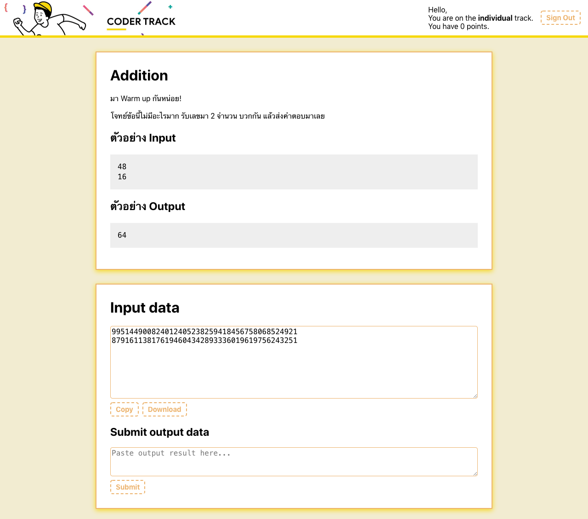
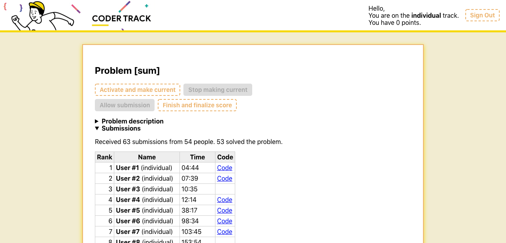
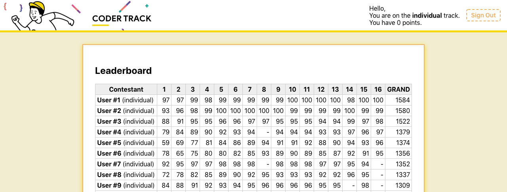

# coder-track-webapp

A platform for real-time speed coding competitions, a la advent of code. Made for [Coding Thailand’s](https://www.codingthailand.org/) Coder Track event with [@iboss-ptk](https://github.com/iboss-ptk).

This project was bootstrapped with <http://github.com/sw-yx/create-react-app-parcel>

## Feature tour

- **Contestants** sign in using Facebook. Once signed in, they can see the problem statement, input data, and can submit a solution.

  

- **Admins** can release problems, making it available to the competitor. Then the input data can be released after the announcer finish reading the problem statement.

  

- **Leaderboard**

  
